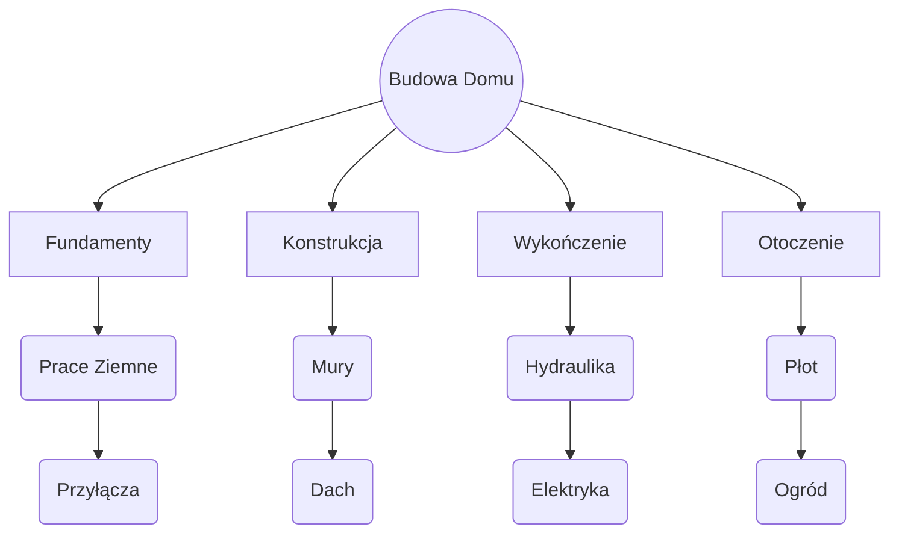

# zpi
ZPI 2025

```mermaid
flowchart TD
    X((Budowa Domu))
    A[Fundamenty]
    B[Konstrukcja]
    C[Wykończenie]
    D[Otoczenie]

    X --> A
    X --> B
    X --> C
    X --> D

    A --> A1(Prace Ziemne) --> A2(Przyłącza)
    B --> B1(Mury) --> B2(Dach)
    C --> C1(Hydraulika) --> C2(Elektryka)
    D --> D1(Płot) --> D2(Ogród)
```
